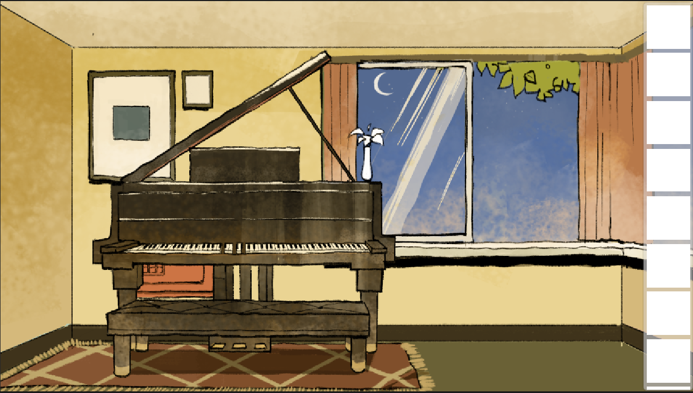
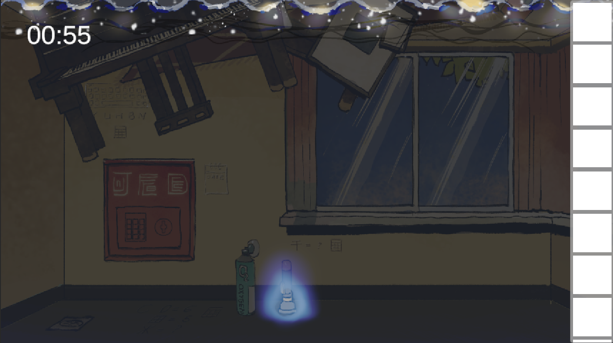
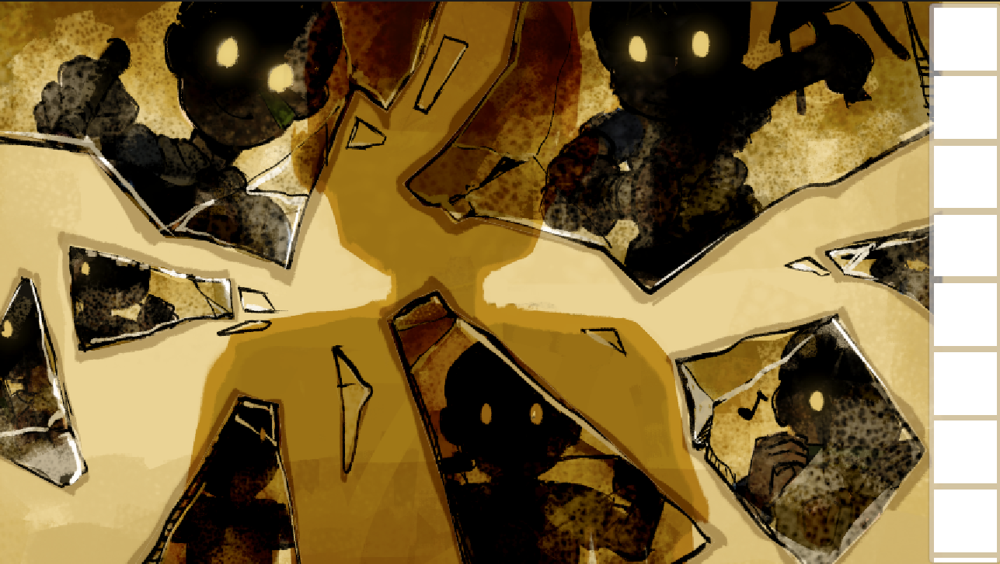
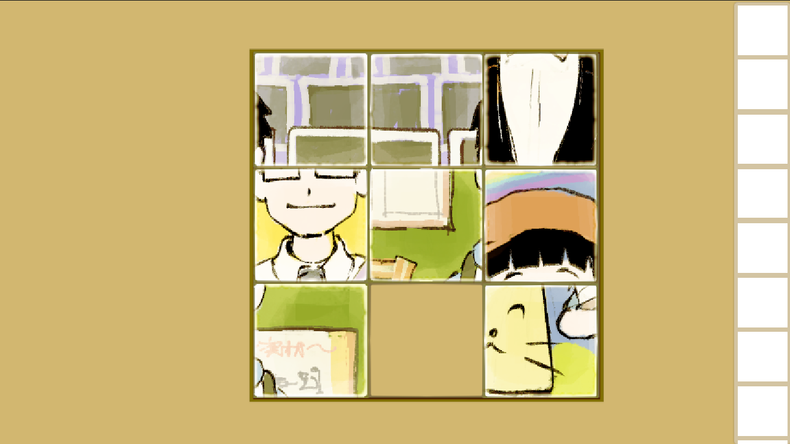
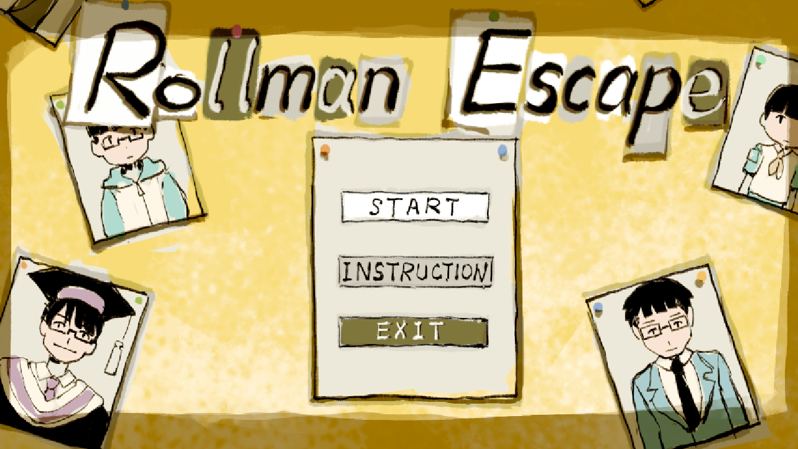
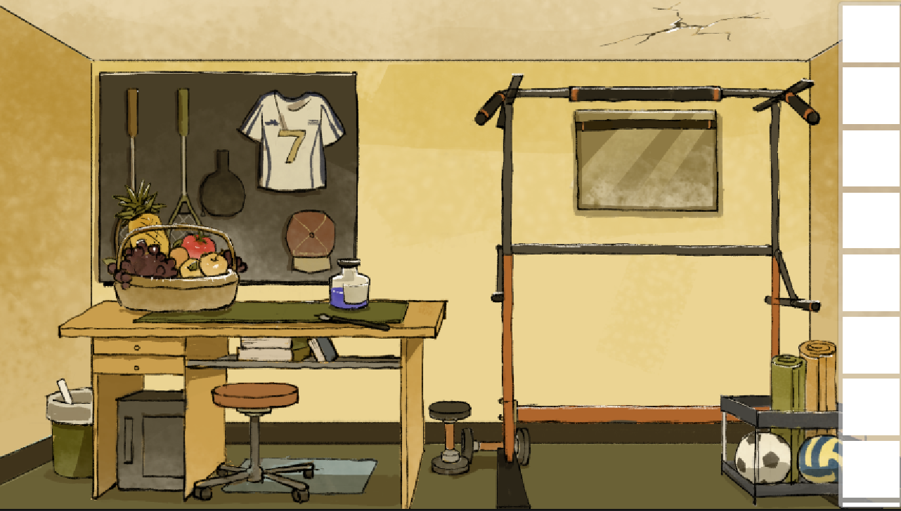

# ROLLMAN_ESCAPE

## 游戏简介

《ROLLMAN_ESCAPE》是一款 2D 解谜闯关游戏。玩家操控主人公，通过与房间内物品交互，寻觅线索、解开谜题，旨在挣脱过往荣誉的羁绊、摆脱他人赞美的裹挟，最终探寻到真实的自我。

## 创意来源

游戏的交互形式借鉴自《锈湖》（《Cube Escape》）系列解谜佳作，故事构思灵感则源于某大学学生的内卷生活状态。游戏名称取自计算机系科协举办的《ROLLMAN》智能体大赛。

## 背景设定

关卡一：主人公深陷于往昔所获的各类荣誉之中。玩家需在房间里找出这些过往荣誉，并探究其使用方法，以此摆脱荣誉的束缚。

关卡二：在收获荣誉后，主人公渐渐被他人赞美的洪流所淹没。玩家得在限定时间内解开谜题，获取道具，进而逃离赞美之水。

关卡三：在逃离赞美的进程中，主人公察觉到自我的模糊与破碎。玩家需借助碎片穿越时空，探寻本真，收集自我拼图的碎片。

关卡四：获取拼图碎片后，玩家要挑选理想的自我形象，将碎片拼接成完整的自我。

## 游戏玩法

玩家可通过操控上下左右键旋转视角，与多种物品展开交互。

可拾取物品：通过鼠标点击进行物品。拾取的物品会收纳在侧边栏的背包中，点击背包内物品即可选中。使用物品后，该物品会消失并触发相应效果。

密码箱：点击密码箱，在键盘中输入正确密码，之后点击旋钮即可打开密码箱。

其余可交互物品：点击不同物品可以触发多样效果，包括但不限于：近距离查看、移动、发出声音、触发机关、绘制图片等。

## 开始界面

点击**START**开始游戏，点击**INSTRUCTION**查看操作说明，点击**EXIT**退出游戏。

## 游戏美术

**游戏美术资源皆为原创**

游戏美术资源均为原创，采用简约朴素的美术风格，既便于玩家查看与提取关键信息，又能最大程度还原真实场景。同时，融入一定的魔幻色彩，丰富交互逻辑。

## 分工情况

汪馨瞳：策划、程序编写、UI设计、组织协调

杨景闻：剧情设计、策划、程序编写、UI设计

王千一：美术、场景设计、策划、游戏测试

## 开发环境

Unity 2022.3.50f1

Visual Studio Code